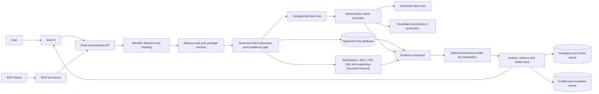
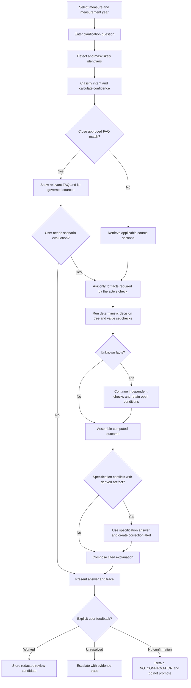
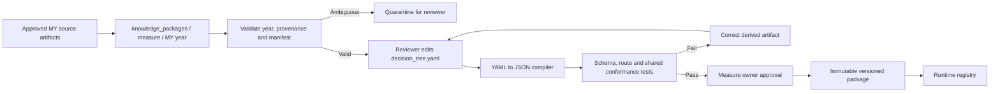

# Measure Navigator reference architecture and solution flow

## Purpose

Measure Navigator clarifies HEDIS measure requirements across multiple measures and measurement years. Questions may cover eligibility, exclusions, numerator evidence, calculation rules, value sets, SQL behavior, or implementation differences. The application checks approved FAQs first, uses governed deterministic logic for scenario evaluation, retrieves source evidence, and uses a reasoning model only to explain results already grounded in the package.

CBP is the most complete synthetic demonstration package. The architecture supports additional measures through the same package contract.

## Runtime architecture

## User solution flow

## Annual package lifecycle

## Source authority

1. Approved measure specification
2. Governed MLD and value-set sources
3. Validated SQL implementation
4. Compiled decision tree and check catalog
5. Reviewed FAQ content

When a derived source disagrees with the specification, the application keeps the specification-grounded answer, marks the response with a conflict, and creates an alert naming the artifact that needs correction. FAQ content never overrides measure logic.

## Visible answer trace

Every resolved response should expose a compact trace containing the selected measure and year, detected intent and confidence, FAQ match decision, package version, checks executed, facts used, open conditions, cited source sections, source authority, and any escalation ID. The interface keeps this information behind the clickable **View audit trace** control so it remains available without cluttering the conversation.

## Implemented prototype and production target

| Capability | Portable prototype | Production target |
|---|---|---|
| Web interface | Flask, HTML, CSS and JavaScript | Enterprise web hosting and identity integration |
| Measure packages | Synthetic JSON, YAML and SQL assets | Licensed, immutable, approved yearly packages |
| FAQ store | Local SQLite | Governed relational store with editorial workflow |
| Rule evaluation | Python evaluator | Snowflake evaluator with shared conformance suite |
| Document retrieval | Local synthetic corpus | Authorized repository and vector or hybrid search |
| Explanation model | Optional integration point | Enterprise-hosted endpoint with audit controls |
| Identifier handling | Warning plus prototype masking | Policy-approved detection, encryption, retention and access controls |
| Escalation | Local conflict records | Workflow integration with ownership and service levels |

