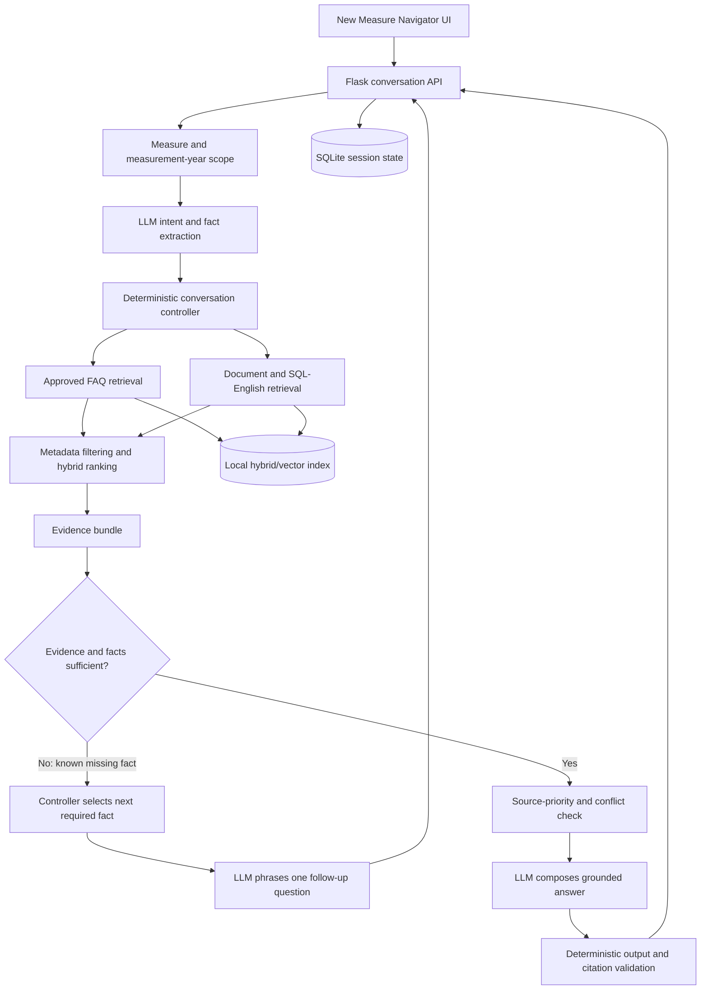
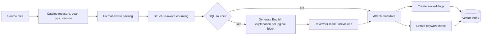

# Target Solution Design

## 1. Product objective

Build a lightweight, multi-measure Measure Navigator that answers measure-specification and implementation questions through the existing chat interface. The application will search approved FAQs and chunked source documents, ask the minimum useful follow-up question, and explain retrieved evidence in plain language.

The hackathon implementation will prioritize demonstrable usefulness over enterprise-scale controls. Production security, advanced PHI governance, high availability, and full editorial governance are deferred, while the existing PHI caution and masking behavior should remain intact.

## 2. Confirmed design constraints

- Build a new standalone UI using the same Coastal Teal visual style, layout, and chatbox conversation pattern as the current Measure Navigator.
- Do not use YAML as a rule or configuration source.
- Store documents as structure-aware chunks with embeddings and searchable metadata.
- Translate stored-procedure and SQL logic into reviewed English explanations.
- Use an LLM to understand questions, extract facts, phrase follow-up questions, and compose grounded answers.
- Keep workflow progression deterministic: Python selects the next required fact or action.
- Treat the specification as authoritative when specification and SQL conflict.
- Do not display irrelevant FAQs merely because they are the nearest available FAQ.
- Support multiple measures and measurement years.

## 2.1 Approved hackathon scope

- Measurement year: MY2026
- Measures: CBP, GSD, KED, EED, and SPC
- Implementation sources: T-SQL stored procedures
- Document sources: measure specifications, Value Set Directory, and Medication List Directory
- Database connectivity and SQL execution: none
- LLM provider: OpenAI
- Vector database: local persisted ChromaDB
- Index refresh: one-time indexing for the hackathon
- Generated English review: informal product-owner inspection during flow testing
- MCP: desirable, but secondary to a stable end-to-end web demonstration
- Input formats: PDF, Word, Excel, CSV, and T-SQL
- Source location: predefined hackathon folder
- FAQ seed: previously generated hackathon FAQ content
- Delivery target: tomorrow

## 3. Design principle: deterministic control, conversational LLM

The LLM does not own the workflow. It operates inside a state and action contract.

The deterministic controller owns:

- measurement-year and measure scope;
- current intent;
- facts already supplied;
- facts still required;
- questions already asked;
- permitted next actions;
- source priority;
- evidence sufficiency;
- stopping, answering, or escalating.

The LLM may:

- classify the initial question into a governed intent;
- extract candidate facts from conversational text;
- phrase a controller-selected missing fact as a natural question;
- summarize and compare retrieved evidence;
- produce a cited explanation from the supplied evidence bundle.

The LLM may not:

- create a new rule or required fact;
- invent thresholds, dates, exclusions, value sets, or SQL behavior;
- override the specification;
- silently resolve conflicting evidence;
- determine actual member compliance without sufficient supplied facts or an approved deterministic result.

## 4. Logical architecture

## 5. Knowledge ingestion

### 5.1 Source types

- Measure specifications
- Stored procedures and SQL files
- Reviewed SQL-to-English explanation documents
- MY2026 Value Set Directory
- MY2026 Medication List Directory
- Supporting measure documents
- Approved FAQs

### 5.1.1 Stored-procedure dependency boundary

Each measure has one primary T-SQL stored procedure containing its measure logic. That procedure may call shared stored procedures or functions. Ingestion should identify referenced dependencies and catalog their names. For the one-day MVP, the system will fully explain the primary measure procedure and include shared dependency text when the referenced source file is present in the predefined folder. Missing dependency definitions must be labelled as unresolved rather than inferred.

### 5.2 Ingestion stages

### 5.3 SQL-to-English rules

SQL remains the implementation source. The English explanation is a retrieval aid and user-facing interpretation.

Because there is no database connection, SQL is never executed. Scenario-level responses explain user-supplied facts using retrieved source logic; they are not calculated from production data.

Each logical SQL block must retain lineage to:

- source filename;
- database object or procedure;
- line or statement range;
- source revision or hash when available;
- measure and measurement year;
- logic category;
- review status.

The translation must distinguish:

- behavior directly present in the SQL block;
- behavior inherited from an upstream object or field;
- specification guidance retrieved from another source;
- interpretation or uncertainty.

CQL is not required for the hackathon design. It may be added later only if it has a defined organizational use.

## 6. Retrieval design

The lightweight design uses one logical knowledge index with metadata-based source separation. Retrieval combines:

1. Mandatory filters: measure, measurement year, eligible status, and source type when needed
2. Embedding similarity for conceptual matching
3. Keyword matching for codes, procedure names, reason codes, values, and exact measure terminology
4. A simple deterministic score blend or reranking step
5. Neighboring chunks when a selected passage depends on a preceding condition or following exception

FAQ retrieval uses a separate, higher relevance threshold. If no FAQ clears the threshold, the FAQ panel remains empty and document retrieval continues.

For the hackathon, the existing generated FAQ set is reused as seed content. It remains lower authority than the specification, VSD/MLD, and SQL sources.

## 7. Conversation state

The session state should conceptually contain:

- session identifier;
- selected measure and measurement year;
- current intent and confidence;
- collected facts and their source turn;
- unresolved or ambiguous facts;
- retrieved evidence identifiers;
- questions already asked;
- current workflow stage;
- final outcome state.

No schema is approved or created at this stage.

## 8. Intent taxonomy

Initial hackathon intents should be limited and governed. Proposed categories are:

- specification clarification;
- eligibility;
- exclusion;
- numerator or compliance;
- reading or event selection;
- value-set or code question;
- data-source permissibility;
- SQL implementation explanation;
- specification-versus-SQL conflict;
- general measure question.

The taxonomy should be tested using representative questions before it is finalized.

## 9. Follow-up-question policy

The controller determines the next action in this order:

1. Resolve measure if unknown.
2. Resolve measurement year if material to the answer.
3. Retrieve evidence using the current question and known facts.
4. If the evidence gives a direct answer, answer without unnecessary questioning.
5. If one or more facts are required, select the highest-priority missing fact.
6. Ask exactly one concise follow-up question.
7. Incorporate the response, update state, and retrieve again.
8. Stop when the answer is supported, the user ends the investigation, or evidence is insufficient.

The LLM may adjust wording to the conversation but cannot change the selected missing fact.

## 10. Answer contract

The user-facing answer should contain only what is useful:

- direct answer or conditional conclusion;
- short explanation;
- relevant source citations;
- any remaining assumption or missing fact;
- conflict warning when applicable.

An optional clickable trace can expose:

- detected intent;
- facts used;
- retrieval sources;
- source priority;
- open condition;
- reason the application answered or asked another question.

For the one-day MVP, the default visible trace is intentionally light: source title, section/page or SQL line reference, facts used, and the remaining open condition. Retrieval scores and detailed controller diagnostics are retained as a future expandable technical trace.

## 11. Source priority

For the hackathon:

1. Measure specification
2. MY2026 Value Set Directory and Medication List Directory, within their governed subject areas
3. Original SQL or stored procedure
4. Reviewed SQL-to-English explanation
5. Approved FAQ

If SQL conflicts with the specification, the answer follows the specification and identifies a potential implementation difference. The hackathon may display the alert without implementing an enterprise ticket workflow.

## 12. Proposed lightweight technology direction

These are recommendations pending approval:

| Capability | Proposed choice |
|---|---|
| Existing UI/API | Flask, HTML, CSS, JavaScript |
| Application state | SQLite |
| SQL parsing | SQLGlot, subject to SQL-dialect validation |
| Local vector retrieval | ChromaDB or an equivalent approved local store |
| Keyword retrieval | SQLite FTS5 or a lightweight BM25 implementation |
| Document parsing | Python format-specific libraries |
| Structured LLM outputs | Pydantic validation |
| LLM and embeddings | Configurable provider adapters |
| MCP | Retain Python MCP surface after core services are stable |

The OpenAI integration must be provider-configurable because the office endpoint may be an internal OpenAI-compatible service. Endpoint URL, deployment/model name, and credential mechanism must remain external configuration rather than application logic.

## 13. Deferred capabilities

The following are intentionally outside the hackathon minimum viable build unless reprioritized:

- enterprise identity and role-based access;
- production PHI governance and retention controls;
- full document approval workflow;
- automatic FAQ learning and publication;
- production ticket-system integrations;
- high availability and horizontal scaling;
- comprehensive model monitoring;
- production data execution against member records.

The existing PHI warning and masking behavior should remain as a basic demonstration safeguard.

## 14. Hackathon implementation boundary

The application may state that a scenario appears to satisfy or fail a rule when the user supplies all required facts and cited documents support that interpretation. It must make clear that it did not query a member database or execute a stored procedure.

The one-time index is built from the approved MY2026 source package for CBP, GSD, KED, EED, and SPC. Annual refresh, incremental indexing, and production document governance remain future capabilities.

## 15. One-day delivery priority

### Core demonstration

1. New standalone UI matching the existing Coastal Teal experience
2. Predefined-folder ingestion for the supplied formats
3. Primary T-SQL procedure segmentation and English explanation
4. One-time ChromaDB index
5. Measure/year-filtered retrieval
6. Deterministic next-fact selection
7. LLM phrasing and cited answer composition
8. Seed FAQ retrieval with a strict relevance threshold
9. Lightweight clickable trace

### Stretch work

- MCP tools
- deep analysis of every shared stored procedure and function
- detailed retrieval-score trace
- document-upload administration
- incremental re-indexing
- production security and governance
