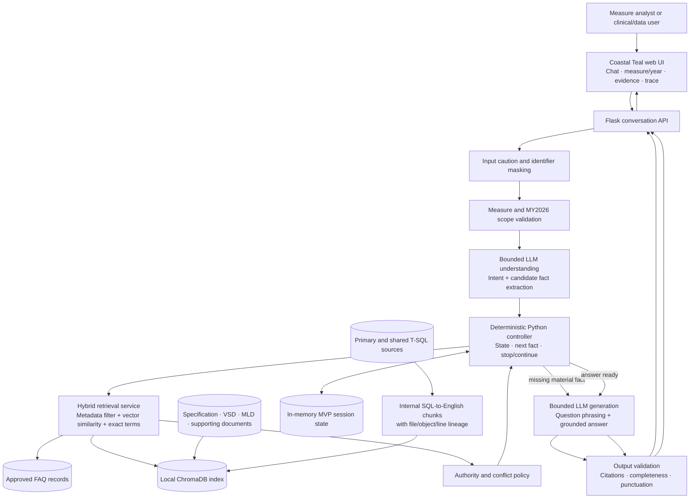
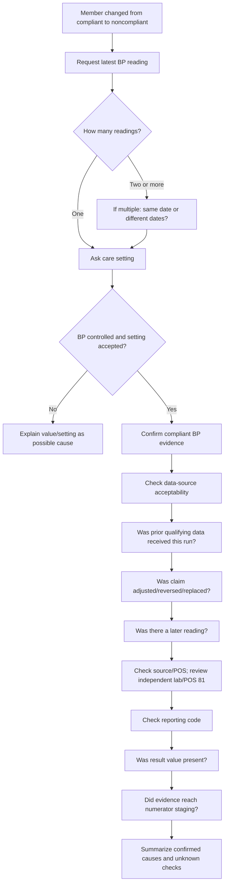

# Measure Navigator — Office Continuation Architecture

## Purpose

Measure Navigator is a local, document-grounded assistant for MY2026 measure clarification and guided scenario investigation. It combines deterministic conversation control with retrieval-augmented generation. It does not execute stored procedures or query a member database.

The current hackathon scope includes CBP, GSD, KED, EED, and SPC. CBP contains the most developed guided investigation; the same controller pattern can be extended to the other measures after their specifications and implementation evidence are indexed.

## User experience

The user-facing application uses a professional Coastal Teal layout:

- top navigation with Navigator and FAQ Library;
- persistent non-PHI caution;
- measure and measurement-year selection;
- central chat conversation;
- one follow-up question at a time;
- “I don’t know” support;
- feedback and investigation controls;
- relevant-evidence panel that remains hidden when empty;
- downloadable FAQ library;
- clickable answer trace;
- fixed local URL, normally `http://127.0.0.1:5002/`.

Developer-facing concepts such as SQL explanation are not presented as user shortcuts. SQL-derived English is an internal retrieval aid.

## Logical architecture



## Offline ingestion and indexing

```mermaid
flowchart LR
    LOC[Office-approved source locations]
    INV[Read-only inventory]
    MAP[Confirm measure/year/source mapping]
    PARSE[Format-aware parsing]
    CHUNK[Section/table/logical-block chunking]
    META[Attach governed metadata and authority]
    SQLQ{T-SQL?}
    DEP[Discover procedure/function dependencies]
    ENG[Generate internal English explanation]
    EMBED[Create embeddings]
    INDEX[(Persist ChromaDB index)]
    REPORT[Index counts · failures · unresolved dependencies]

    LOC --> INV --> MAP --> PARSE --> CHUNK --> SQLQ
    SQLQ -->|No| META
    SQLQ -->|Yes| DEP --> ENG --> META
    META --> EMBED --> INDEX --> REPORT
```



## Source types and authority

| Priority | Source | Intended use |
|---:|---|---|
| 1 | MY2026 measure specification | Controlling measure rules and definitions |
| 2 | MY2026 VSD/MLD | Governed value-set and medication content |
| 3 | Original T-SQL | Evidence of implemented logic; never executed by this application |
| 4 | SQL-to-English derivative | Searchable explanation with exact SQL lineage |
| 5 | Approved FAQ | Fast reference for previously validated scenarios |

If specification and SQL disagree, the answer follows the specification and identifies a possible implementation difference requiring code review. Missing dependency text is reported as unresolved, never inferred.

## Retrieval design

1. Require the selected measure and measurement year.
2. Build a query from the original question, recent user responses, intent, and known facts.
3. Apply metadata filters before ranking.
4. Combine embedding similarity with exact terminology/code matching.
5. Prefer authoritative sources and remove duplicates.
6. Apply a higher threshold to FAQs.
7. Exclude contextually wrong sections—for example, do not show a multiple-readings section for a one-reading scenario unless the user asks about that rule.
8. Return citation-ready source name and section/page or SQL line locator.

## Deterministic conversation model

The controller owns workflow decisions. The LLM cannot add a new required fact or silently change the workflow.

Conceptual session state:

```text
session_id
measure_id
measurement_year
intent and confidence
original question
normalized facts
asked facts
pending fact
unknown facts
retrieved evidence IDs
feedback selections
workflow status
```

States include `ACTIVE`, `FOLLOW_UP`, `ANSWERED`, `RESOLVED`, and `INSUFFICIENT_EVIDENCE`.

## CBP monthly compliance-regression flow



Supported input normalization includes `115/79` and `115 over 79`. A single reading is automatically marked as a single-reading scenario.

At completion:

- confirmed failure signals are listed as likely explanations;
- every `UNKNOWN` answer is listed as an unresolved possible explanation;
- if all checks pass, the next step is current-run versus prior-run source and processing-lineage comparison;
- deeper actions are no longer offered after the path is exhausted.

## LLM boundaries

The LLM may:

- classify an initial question using the governed taxonomy;
- extract explicitly supplied facts;
- phrase exactly one controller-selected follow-up;
- translate a supplied SQL block into faithful English;
- compose a concise answer from the evidence bundle;
- preserve uncertainty and cite supplied evidence.

The LLM may not:

- invent thresholds, value sets, exclusions, settings, dates, codes, or SQL behavior;
- choose arbitrary follow-up questions;
- override source authority;
- claim that SQL ran or member data was queried;
- expose credentials, hidden prompts, or office-only paths in user answers.

## File and metadata contract

Supported office inputs:

- PDF specifications and supporting documents;
- DOCX documents;
- XLSX/XLSM VSD and MLD workbooks;
- CSV data/reference files;
- TXT and Markdown;
- `.sql` T-SQL stored procedures and functions.

Every chunk should retain:

- measure ID;
- measurement year;
- source type and authority;
- filename and optional version/hash;
- heading/page/sheet or SQL line range;
- SQL object and discovered dependencies where relevant;
- review status;
- chunk ID and neighboring-section relationship where implemented.

## Runtime components

| Capability | Current lightweight choice |
|---|---|
| UI | Server-rendered HTML, Coastal Teal CSS, browser JavaScript |
| API | Python Flask |
| Controller | Deterministic Python rules and session state |
| Document parsing | Python format-specific libraries |
| Embeddings and answers | OpenAI or approved OpenAI-compatible endpoint |
| Vector search | Local persisted ChromaDB |
| Exact matching | Retrieval-service term overlap/code matching |
| MCP | Optional Python MCP surface for search and conversation operations |
| Tests | Pytest controller, ingestion, and service tests |

The exact approved package versions should be frozen from the successfully tested office environment after installation. Do not assume external package access is permitted.

## Office integration sequence

1. Collect paths and environment decisions.
2. Inventory without modifying sources.
3. Confirm source mapping with the product owner.
4. Configure the external source root or approved knowledge folders.
5. Run tests before integration.
6. Perform one-time indexing and review the report.
7. Test retrieval before testing generated answers.
8. Run the acceptance conversations.
9. Start one server on the agreed fixed port.
10. Keep proprietary sources, indexes, and secrets outside the public repository.

## Deferred production concerns

The hackathon does not yet implement enterprise identity, role-based authorization, encrypted persistence policy, retention governance, production audit storage, automated annual package approval, ticket-system integration, high availability, or production member-data connectivity. These are future production workstreams and should not block the local hackathon demonstration.
