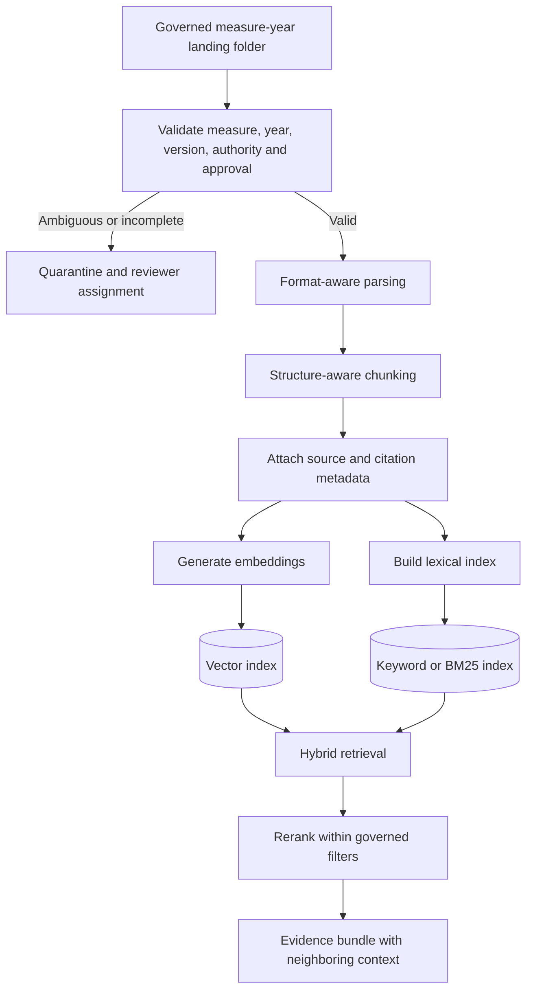
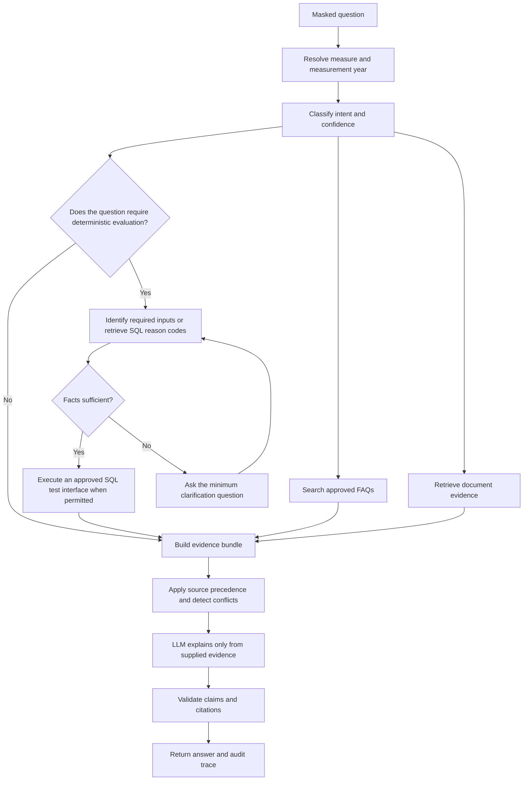
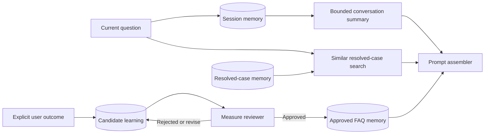

# Proposed solution architecture

## Objective

Build a multi-measure, multi-year HEDIS clarification system that can answer specification questions, investigate scenario-level compliance or exclusion questions, explain implementation logic, identify conflicts, and learn from explicitly confirmed outcomes without treating prior answers as authoritative evidence.

The design combines four different capabilities because no single technique covers the full problem:

1. Governed FAQ retrieval for fast, reviewed answers
2. Hybrid document retrieval for specification and implementation evidence
3. Governed SQL execution or SQL-derived reason codes for calculations and implementation logic
4. LLM reasoning for explanation, synthesis, comparison, and follow-up conversation

## Logical architecture

```mermaid
flowchart LR
    USER[User] --> UI[Measure Navigator UI]
    UI --> ORCH[Conversation and workflow orchestrator]
    MCP[MCP clients] --> GATE[MCP tool gateway]
    GATE --> ORCH

    ORCH --> SAFE[Identifier detection, masking and warning]
    SAFE --> SCOPE[Measure, measurement year and question scope]
    SCOPE --> INTENT[Governed intent classifier and confidence gate]

    INTENT --> FAQ[Approved FAQ hybrid search]
    INTENT --> RETRIEVE[Document hybrid retrieval]
    INTENT --> RULES[SQL implementation analysis or controlled execution]
    INTENT --> CLARIFY[Clarification-question planner]

    FAQ --> RERANK[Metadata filter and reranker]
    RETRIEVE --> RERANK
    RERANK --> EVIDENCE[Evidence bundle]

    RULES --> SQL[Validated SQL and stored procedures]
    SQL --> EXPLAIN[Reviewed English code explanation]
    SQL --> FACTS[Controlled scenario results and reason codes]
    EXPLAIN --> EVIDENCE
    FACTS --> EVIDENCE

    CLARIFY --> FACTS
    FACTS --> ORCH

    EVIDENCE --> AUTH[Source-authority and conflict engine]
    AUTH --> PROMPT[Prompt and context assembler]
    PROMPT --> LLM[Enterprise LLM reasoning]
    LLM --> VALIDATE[Grounding and citation validator]
    VALIDATE --> ANSWER[Answer, citations and visible trace]
    ANSWER --> UI

    ORCH --> SESSION[(Session memory)]
    ANSWER --> CASES[(Resolved-case memory)]
    ANSWER --> LEARN[(FAQ candidate and review queue)]
    AUTH --> ALERT[(Conflict and escalation queue)]
```

## Document ingestion and retrieval

### Structure-aware chunking

| Source | Chunk boundary | Required metadata |
|---|---|---|
| Specification | Section, subsection, requirement paragraph, note or table row | Measure, year, page, section, version, authority |
| MLD | Population or rule block | Rule ID, population, measure, year, version |
| VSD | Value-set definition or code grouping | OID, code system, release, measure, year |
| SQL or stored procedure | Procedure, CTE, logical condition or documented rule block | Object name, lines, revision, environment, derived-rule ID |
| SQL explanation | Procedure section, logical condition or reason-code explanation | SQL object, line range, SQL hash, explanation version and approval |
| FAQ | Reviewed question and answer | Approval status, citations, measure, year, reviewer |
| Prior resolved case | Generalized scenario and resolution | Non-authoritative label, outcome state, supporting sources |

Retrieval first applies measure, year, access, status, and document-type filters. Semantic and lexical search then run within that eligible set. A reranker selects the final evidence and may attach adjacent chunks so the LLM does not receive an isolated sentence without its qualifier or exception.

## Query orchestration

## LLM responsibility

The LLM performs bounded reasoning after retrieval and deterministic evaluation. It may:

- Explain a specification in plain language
- Compare specification language with SQL and its reviewed English explanation
- Combine several cited sections into one coherent answer
- Ask a contextually appropriate follow-up question selected from allowed facts
- Describe conditional outcomes when facts remain unknown
- Summarize why an escalation was created

The LLM may not:

- Invent thresholds, exclusions, value sets, dates, or measure rules
- Override the authoritative specification
- Convert a prior case into approved guidance
- Treat missing evidence as proof
- Remove an open condition created by the deterministic service
- Cite a source or section absent from the evidence bundle

## Prompt architecture

The prompt assembler should create a versioned request with these sections:

1. **System policy**: role, source authority, prohibited behaviors, privacy handling, uncertainty rules
2. **Task instruction**: clarification, comparison, scenario explanation, or conflict analysis
3. **Scope**: measure, measurement year, package version, user role and selected intent
4. **Masked conversation**: only turns needed for the active task
5. **Structured facts**: normalized facts, unknowns and provenance
6. **Deterministic results**: checks, aggregation results and open conditions
7. **Retrieved evidence**: chunk text, source IDs, section/page markers, authority and retrieval scores
8. **FAQ evidence**: only approved matches with citations
9. **Output contract**: answer, qualification, citations, trace summary and escalation recommendation

All prompt templates require a version, owner, approval status, test cases, and change history. The complete assembled prompt belongs in the protected audit record, subject to retention policy.

## Memory architecture

### Memory boundaries

| Memory | What it contains | Authority | Use |
|---|---|---|---|
| Session memory | Masked turns, selected scope, collected facts and open conditions | Context only | Maintain the active conversation |
| Case memory | Generalized prior questions, evidence and resolution status | Non-authoritative | Help find similar investigations |
| Candidate learning | Explicitly confirmed or unresolved outcomes awaiting review | Not searchable as approved guidance | Editorial queue and test-case candidate |
| Approved FAQ memory | Reviewer-approved answer and current citations | Reviewed guidance below specification | Fast retrieval and download |
| Audit memory | Prompt version, sources, checks, model response and validation | Reproducibility record | Review, monitoring and incident analysis |

Questions with no explicit outcome remain `NO_CONFIRMATION`. Repetition or helpful votes can prioritize review but cannot establish clinical or measure truth.

## Source authority and conflicts

1. Approved specification
2. Governed MLD and VSD interpretation
3. Validated executable SQL
4. Reviewed SQL-to-English explanation
5. Reviewed FAQ
6. Prior resolved cases

The system should distinguish a true contradiction from an incomplete source, measurement-year mismatch, implementation lag, and retrieval ambiguity. When a real conflict remains, it returns the specification-grounded answer, labels the conflict, identifies the derived artifact, and creates an escalation. The LLM describes the conflict but cannot reconcile it silently.

## Technology options for design approval

| Capability | Portable hackathon option | Enterprise option |
|---|---|---|
| Vector and lexical retrieval | PostgreSQL with pgvector, Qdrant, or Chroma plus a lexical index | Snowflake Cortex Search or Azure AI Search |
| Document parsing | Python format-specific parsers | Approved document ingestion service |
| Embeddings | Approved embedding model | Enterprise-hosted embedding endpoint |
| LLM | Configurable model adapter | Enterprise-hosted reasoning endpoint |
| Operational data | PostgreSQL or SQLite for a local demo | Governed relational database |
| Deterministic rules | Explanation-only SQL analysis or synthetic test harness | Governed Snowflake stored procedures and reason-code interface |
| Orchestration | Python service exposed through MCP and web APIs | Same logical services behind enterprise identity and observability |

The final selection should follow the office environment's approved cloud, Snowflake, identity, and model standards.

## Observability and evaluation

The design needs separate evaluations for retrieval, deterministic correctness, explanation grounding, and user usefulness.

- Retrieval: recall at K, citation relevance, year-filter violations and missing adjacent context
- Rules: shared fixtures across Python and Snowflake, aggregation correctness and regression by measure package
- LLM: unsupported-claim rate, citation completeness, open-condition preservation and conflict-policy compliance
- Workflow: FAQ deflection, resolution confirmation, unresolved escalation rate and reviewer turnaround
- Privacy: identifier-detection test set, masked-output verification and retention-policy checks

No placeholder metric should be presented as a measured result.

## Production trust boundary

The document repository, indexes, prompts, conversation memory, model endpoint, and audit store must remain inside approved enterprise boundaries. Access checks apply during retrieval, not only when documents are ingested. Licensed content must not appear in logs or citations available to unauthorized users.
