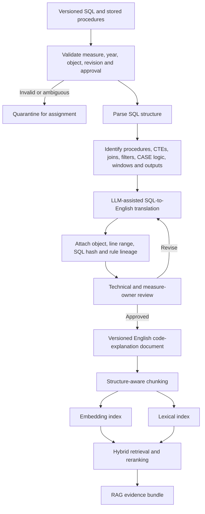

# SQL-to-English retrieval and RAG design

## Confirmed design constraint

Measure teams will provide SQL and stored procedures, not a YAML decision tree. The proposed architecture therefore treats governed SQL as the executable implementation source and generates a traceable English code-explanation document for retrieval and RAG.

The English explanation is a derived artifact. It helps users understand the implementation but does not outrank the approved measure specification or the original SQL.

## Processing flow



## SQL parsing units

The converter should not translate an entire stored procedure as one narrative. It should create linked explanation units for:

- Procedure purpose, parameters and outputs
- Source tables and important joins
- Population inclusion logic
- Exclusion logic
- Numerator logic
- Value-set joins and code filters
- Date and lookback conditions
- Event grouping and deduplication
- Ranking and representative-event selection
- Aggregation and threshold logic
- Temporary tables and intermediate datasets
- Final status or reason-code assignment
- Exception handling and unresolved behavior

Each unit must point back to exact SQL locations.

## Explanation document structure

```text
Document identity
  Measure and measurement year
  SQL object name and revision
  Source repository and commit
  SQL hash
  Generation prompt version
  Reviewer and approval state

Procedure overview
  Business purpose
  Required inputs
  Produced outputs

Rule explanations
  Rule ID
  Plain-English explanation
  SQL object and line range
  Tables and columns used
  Value sets and date windows
  Dependencies
  Known limitations

Reason-code map
  Output status
  Triggering SQL condition
  Plain-English meaning

Specification comparison
  Supporting specification sections
  Confirmed alignment
  Potential conflict or ambiguity
```

## Chunk record

Every searchable chunk should carry metadata conceptually equivalent to:

```json
{
  "measure_id": "CBP",
  "measurement_year": 2026,
  "document_type": "SQL_EXPLANATION",
  "sql_object": "SP_CALCULATE_CBP",
  "sql_revision": "commit-or-release-id",
  "sql_hash": "sha256",
  "rule_id": "CBP-NUM-READING-SELECTION",
  "sql_line_start": 410,
  "sql_line_end": 468,
  "explanation_version": "1.0",
  "approval_status": "APPROVED",
  "authority": "DERIVED_IMPLEMENTATION_EXPLANATION",
  "specification_refs": ["CBP specification section reference"]
}
```

The physical schema and field names will be selected during implementation design.

## Retrieval behavior

For a question such as “Why did this scenario become excluded?”, retrieval should search:

1. The approved specification
2. The approved SQL explanation
3. The original SQL chunk or line reference
4. Approved FAQs
5. Similar reviewed cases, clearly marked as non-authoritative

The search first filters by measure and measurement year. It then uses both lexical and vector search, reranks the results, and adds neighboring explanation chunks when needed.

Exact identifiers such as procedure names, column names, codes and reason codes should receive strong lexical weight. Natural-language questions should benefit from semantic similarity.

## LLM roles

### Generation-time LLM

The generation-time model translates parsed SQL units into English. It must preserve identifiers, conditions, comparison operators, null behavior and grouping semantics. Its output requires review before indexing as approved content.

### Question-time LLM

The question-time model reasons over retrieved specification and SQL-explanation chunks. It explains alignment or disagreement and cites the retrieved sources. It cannot claim that generated English is more authoritative than SQL or the specification.

These should use separately versioned prompts and evaluation sets.

## Deterministic evaluation without YAML

The production SQL remains the executable calculation. The application can use one of two approved modes:

### Explanation-only mode

The application retrieves and explains SQL logic but does not execute a member-level calculation. This is appropriate when data access is unavailable.

### Controlled scenario-evaluation mode

A governed SQL test interface accepts a synthetic or permitted structured scenario and returns reason codes, intermediate rule results and provenance. The application explains those results. The LLM does not simulate the stored procedure.

The design should not rebuild the SQL logic in a second hand-authored decision tree because that creates avoidable logic drift.

## Required validation

- SQL parser coverage and unsupported-syntax detection
- Translation fidelity for boolean logic, joins, nulls, dates and aggregations
- Identifier preservation
- Lineage-link accuracy
- Specification-versus-SQL comparison
- Measurement-year isolation
- Chunk-boundary and neighboring-context tests
- Retrieval recall for natural-language and exact-code questions
- Hallucination and citation-completeness tests
- Reviewer sign-off before an explanation enters the approved index

## Conflict rule

When the specification and SQL differ, the user-facing answer states the specification requirement, identifies the conflicting SQL object and explanation chunk, and opens a code-correction alert. The system must not rewrite the English explanation to hide the mismatch.

